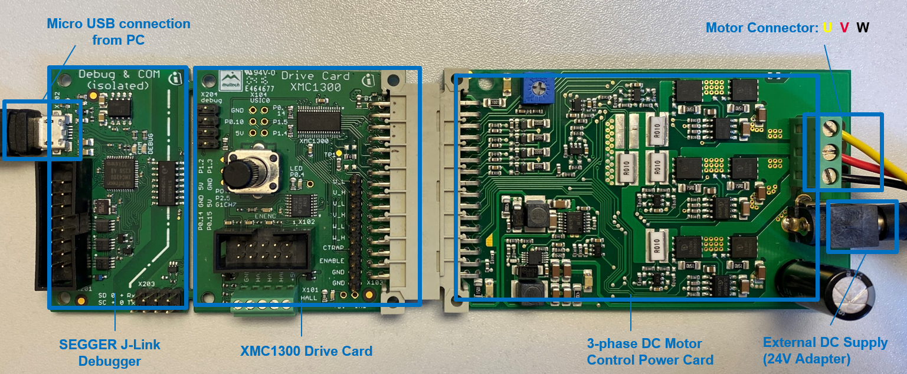
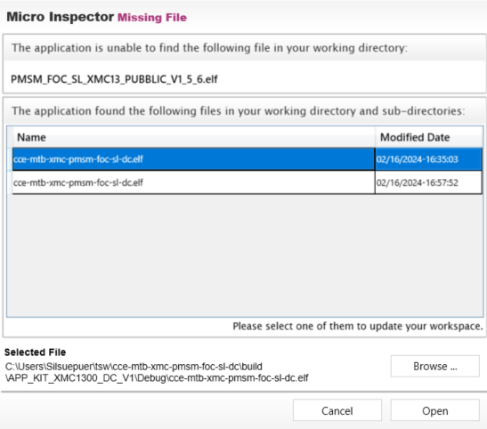
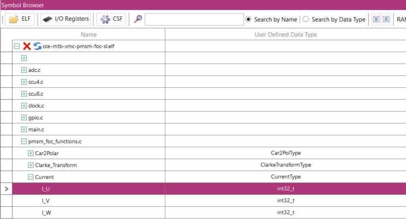
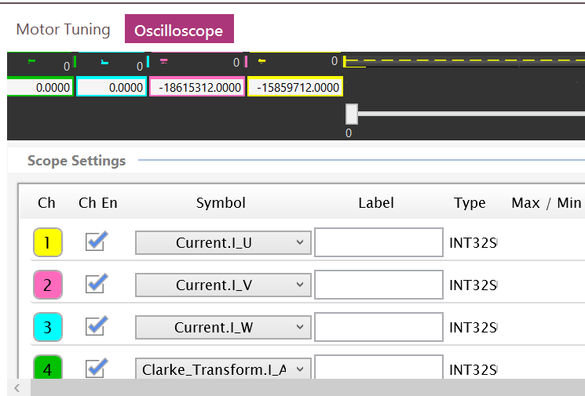
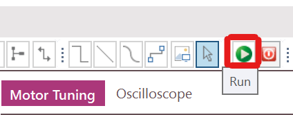
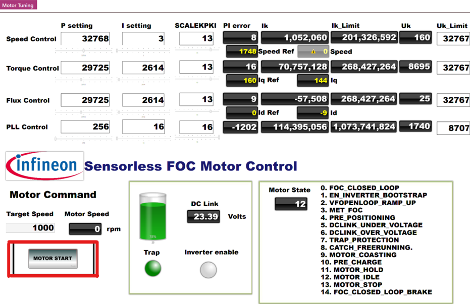
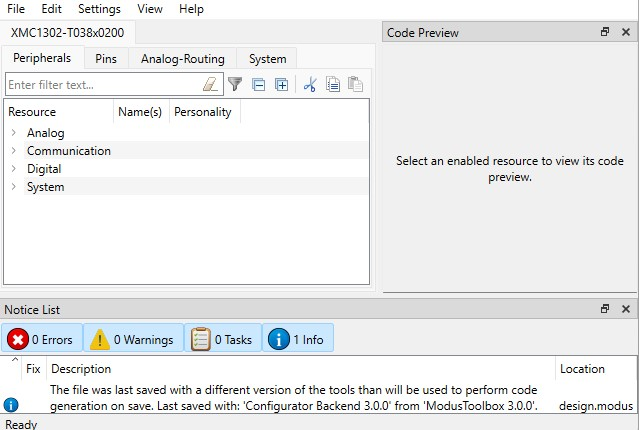

# PMSM FOC SL XMC&trade;13/14 Drive Card

_Disclaimer: This is a community code example (CCE) released for the benefit of the community users. These projects have only been tested for the listed BSPs, tools versions, and toolchains documented in this readme. They are intended to demonstrate how a solution / concept / use-case can be achieved on a particular device. For official code examples, please click [here](https://github.com/Infineon/Code-Examples-for-ModusToolbox-Software)._

This community code example (CCE) demonstrates the sensorless PMSM FOC motor control application using XMC1300/1400 Drive Card. In order to test this software; [XMC1300](https://www.infineon.com/cms/en/product/evaluation-boards/kit_xmc1300_dc_v1/) or [XMC1400 Drive Card](https://www.infineon.com/cms/en/product/evaluation-boards/kit_xmc1400_dc_v1/), [3-phase DC power board](https://www.infineon.com/cms/en/product/evaluation-boards/kit_motor_dc_250w_24v/), and Nanotec DC motor (DB42S03) are needed.

## Requirements

- [ModusToolbox&trade; software](https://www.infineon.com/modustoolbox) v3.1 or later (tested with v3.1)
- [SEGGER J-Link software](https://www.segger.com/downloads/jlink/#J-LinkSoftwareAndDocumentationPack) v7.92d
- Programming language: C
- Associated parts: [XMC1300 MCU](https://www.infineon.com/cms/en/product/microcontroller/32-bit-industrial-microcontroller-based-on-arm-cortex-m/32-bit-xmc1000-industrial-microcontroller-arm-cortex-m0/xmc1300/), [XMC1400 MCU](https://www.infineon.com/cms/en/product/microcontroller/32-bit-industrial-microcontroller-based-on-arm-cortex-m/32-bit-xmc1000-industrial-microcontroller-arm-cortex-m0/xmc1400/)

## Supported toolchains (make variable 'TOOLCHAIN')

- GNU Arm&reg; embedded compiler v11.3 (`GCC_ARM`) - Default value of `TOOLCHAIN`

## Supported Kits

- [XMC1300 Drive Card](https://www.infineon.com/cms/en/product/evaluation-boards/kit_xmc1300_dc_v1/) (`KIT_XMC1300_DC_V1`)
- [XMC1400 Drive Card](https://www.infineon.com/cms/en/product/evaluation-boards/kit_xmc1400_dc_v1/) (`KIT_XMC1400_DC_V1`)

## Hardware setup

Before using this code example, make sure that the XMC1300/1400 drive card is correctly connected to the 3-phase DC Power Card. The Nanotec motor also needs to be connected to the power card accordingly as in Figure 1. Please see this [User Manual](https://www.infineon.com/dgdl/Infineon-AN_250W_DriveCard-UM-v01_00-EN.pdf?fileId=5546d462696dbf120169a10447b76f33) for more details. 



**Figure 1. Complete hardware setup example with XMC Drive Card, Power Board, and Nanotec Motor**

## Software setup

This code example uses Micro Inspector Pro application by default to run and control the motor from a GUI. Click [here](https://softwaretools.infineon.com/tools/com.ifx.tb.tool.ifxmicroinspectorpro) to download the application.

Please follow the steps below to control the motor from the Micro Inspector Pro application.

**Note:** If you want to run the motor without using Micro Inspector Pro application, please change the "**motor_request_start**" flag to "**true**" in line 60 inside main.c file.

## Using the code example

Create the project and open it using one of the following:

<details open><summary><b>In Eclipse IDE for ModusToolbox&trade; software (recommended)</b></summary>

1. Click the **New Application** link in the **Quick Panel** (or, use **File** > **New** > **ModusToolbox&trade; Application**). This launches the [Project Creator](https://www.infineon.com/ModusToolboxProjectCreator) tool.

2. Select the kit XMC1300 drive card (`KIT_XMC1300_DC_V1`) or XMC1400 drive card (`KIT_XMC1400_DC_V1`)  from the **XMC&trade; BSPs** list shown in the **Project Creator - Choose Board Support Package (BSP)** dialog.

3. In the **Project Creator - Select Application** dialog, choose the example from the list **Community Code Examples** by enabling the checkbox.

4. (Optional) Change the suggested **New Application Name**.

5. The **Application(s) Root Path** defaults to the Eclipse workspace which is usually the desired location for the application. If you want to store the application in a different location, you can change the *Application(s) Root Path* value. Applications that share libraries should be in the same root path.

6. Click **Create** to complete the application creation process.

7. To build the project, click **Build Application** from the Quick Panel.

8. To start the debugging session to run the motor, click **Generate Launches for "YourApplicationName"** in Quick Panel. Then click to **YourApplicationName Debug (Jlink)**. A debugging window will appear and the session will automatically pause in a breakpoint. Click **Resume** button from the above toolbar to continue the session.

9. While the debugging session is running, open the Micro Inspector Pro application. Click **Open Workspace** button from the upper left corner.


**Figure 2. Opening the workspace folder in Micro Inspector Pro**

10. Find the "PMSM_FOC_SL_XMC1_uCProbe.wspx" file from your ModusToolbox workspace folder and select **Open**. A pop-up window will appear to show the existing elf file. Select the one shown and click **Open**. If there is not any elf file shown in the pop-up window, please click **Browse** and go to your ModusToolbox workspace "..\cce-mtb-xmc-pmsm-foc-sl-dc\build\APP_KIT_XMC1300_DC_V1\Debug" to open the elf file from there. If you are using XMC14, elf file path is ""..\cce-mtb-xmc-pmsm-foc-sl-dc\build\APP_KIT_XMC1400_DC_V1\Debug". 



**Figure 3. Selecting the elf file**

11. In the "Symbol Browser" section, you can click the **+** button from the left side of the elf file to further expand the file. For example if you go to **pmsm_foc_functions.c / Current**, you can select a parameter by double clicking it to enable that parameter for the oscilloscope.



**Figure 4. Adding different parameters to the oscilloscope channels**

12. Before running the motor, go to **Oscilloscope** window to select the parameters that you want to observe in real time. The parameters that you selected in the previous step will appear in the symbol selection. Make sure to enable 4 channels and select the parameters that you want to observe.



**Figure 5. Selecting the parameters to observe from the oscilloscope in running mode**

13. To run and control the motor from the GUI, switch to running mode by clicking **Run** button.



**Figure 6. Switching to running mode**

14. Press **Motor Start** to run the motor. You can also adjust the motor speed by changing the "Target" rpm.



**Figure 7. Motor control part of the running mode**

15. Right click the **Oscilloscope** tab and select **New Vertical Tab Group** in order to observe your parameters from the oscilloscope on the right side while observing the motor control parameters on the left side simultaneously.


**Figure 8. Three-phase currents observed from the oscilloscope**


**Note:** This code does not use the Device Configurator in ModusToolbox. All peripheral definitions and initializations are directly integrated within the software using low level drivers by calling the necessary libraries. When the user wants to change a configuration variable or parameter, it should be done within the code in the user config header files rather than in the Device Configurator.



**Figure 9. Device Configurator in ModusToolbox**


For more details, see the [Eclipse IDE for ModusToolbox&trade; software user guide](https://www.infineon.com/MTBEclipseIDEUserGuide) (locally available at *{ModusToolbox&trade; software install directory}/ide_{version}/docs/mtb_ide_user_guide.pdf*).

</details>

<details open><summary><b>In command-line interface (CLI)</b></summary>


ModusToolbox&trade; software provides the Project Creator as both a GUI tool and the command line tool, "project-creator-cli". The CLI tool can be used to create applications from a CLI terminal or from within batch files or shell scripts. This tool is available in the *{ModusToolbox&trade; software install directory}/tools_{version}/project-creator/* directory.

Alternatively, you can manually create the application using the following steps:

1. Download and unzip this repository onto your local machine, or clone the repository.

2. Use a CLI terminal to invoke the "project-creator-cli" tool. On Windows, use the command line "modus-shell" program provided in the ModusToolbox&trade; software installation instead of a standard Windows command-line application. This shell provides access to all ModusToolbox&trade; software tools. You can access it by typing `modus-shell` in the search box in the Windows menu. In Linux and macOS, you can use any terminal application.

The "project-creator-cli" tool has the following arguments:

Argument | Description | Required/optional
---------|-------------|-----------
`--board-id` | Defined in the `<id>` field of the [BSP](https://github.com/Infineon?q=bsp-manifest&type=&language=&sort=) manifest | Required
`--app-id`   | Defined in the `<id>` field of the [CE](https://github.com/Infineon?q=ce-manifest&type=&language=&sort=) manifest | Required
`--target-dir`| Specify the directory in which the application is to be created if you prefer not to use the default current working directory | Optional
`--user-app-name`| Specify the name of the application if you prefer to have a name other than the example's default name | Optional

<br />

The following example clones the "[PMSM FOC SL XMC13/14 DC](https://github.com/Infineon/cce-mtb-xmc-pmsm-foc-sl-dc)" application with the desired name "cce-mtb-xmc-pmsm-foc-sl-dc" configured for the *KIT_XMC1300_DC_V1* BSP into the specified working directory, *C:/mtb_projects*:

   ```
   project-creator-cli --board-id KIT_XMC1300_DC_V1 --app-id cce-mtb-xmc-pmsm-foc-sl-dc --user-app-name cce-mtb-xmc-pmsm-foc-sl-dc --target-dir "C:/mtb_projects"
   ```
   
   **Note:** The cloned application contains a default BSP file (*TARGET_xxx.mtb*) in the *bsps* folder. Use the [Library Manager](https://www.infineon.com/ModusToolboxLibraryManager) (`make modlibs` command) to select or add a different BSP file, if required. If the selected kit does not have the required resources or is not supported, the application may not work.

3. Import the required libraries by executing the `make getlibs` command.

Various CLI tools include a `-h` option that prints help information to the terminal screen about that tool. For more details, see the [ModusToolbox&trade; software user guide](https://www.infineon.com/ModusToolboxUserGuide) (locally available at *{ModusToolbox software install directory}/docs_{version}/mtb_user_guide.pdf*).

</details>

<details open><summary><b>In third-party IDEs</b></summary>

**Note:** Only VS Code is supported.

1. Follow the instructions from the **In command-line interface (CLI)** section to create the application, and import the libraries using the `make getlibs` command.

2. Export the application to a supported IDE using the `make <ide>` command.

   For a list of supported IDEs and more details, see the "Exporting to IDEs" section of the [ModusToolbox&trade; software user guide](https://www.infineon.com/ModusToolboxUserGuide) (locally available at *{ModusToolbox software install directory}/docs_{version}/mtb_user_guide.pdf*).

3. Follow the instructions displayed in the terminal to create or import the application as an IDE project.

</details>

## Related resources


Resources | Links
--------------------|----------------------
Code examples  | [Using ModusToolbox&trade; software](https://github.com/Infineon/Code-Examples-for-ModusToolbox-Software) on GitHub|
Kit guide|  [XMC1300 Drive Card](https://www.infineon.com/dgdl/Board_Users_Manual_DriveCard_XMC1300_R1.0.pdf?fileId=db3a3043427ac3e201427f4a37de262b) - Drive Card User‘s Manual. Describes the schematic and hardware of XMC1300 Drive Card.
Device documentation| [XMC1000 family datasheets](https://www.infineon.com/cms/en/product/microcontroller/32-bit-industrial-microcontroller-based-on-arm-cortex-m/32-bit-xmc1000-industrial-microcontroller-arm-cortex-m0/#document-group-myInfineon-49) <br> [XMC1000 family technical reference manuals](https://www.infineon.com/cms/en/product/microcontroller/32-bit-industrial-microcontroller-based-on-arm-cortex-m/32-bit-xmc1000-industrial-microcontroller-arm-cortex-m0/#document-group-myInfineon-44)
Development kits | Buy at www.infineon.com<br>[KIT_XMC1300_DC_V1](https://www.infineon.com/cms/en/product/evaluation-boards/kit_xmc1300_dc_v1/) – Drive Card XMC1300 <br> [KIT_XMC1400_DC_V1](https://www.infineon.com/cms/en/product/evaluation-boards/kit_xmc1400_dc_v1/) – Drive Card XMC1400 <br> [KIT_MOTOR_DC_250W_24V](https://www.infineon.com/cms/en/product/evaluation-boards/kit_motor_dc_250w_24v/) – 3-phase DC Motor Control Power Card |
PMSM FOC guide | [XMC1000 PMSM FOC](https://www.infineon.com/dgdl/Infineon-AP32370_PMSM_FOC_for_XMC1000_4000-ApplicationNotes-v01_06-EN.pdf?fileId=5546d4626bb628d7016be669c3eb7e60) – Application notes for PMSM FOC motor control software using XMC
Libraries on GitHub  | [mtb-xmclib-cat3](https://github.com/Infineon/mtb-xmclib-cat3) – XMC&trade; peripheral driver library (XMCLib) and docs 
Tools | [Eclipse IDE for ModusToolbox&trade; software](https://www.infineon.com) – ModusToolbox&trade; software is a collection of easy-to-use software and tools enabling rapid development with Infineon MCUs, covering applications from embedded sense and control to wireless and cloud-connected systems.

## Other resources

Infineon provides a wealth of data at www.infineon.com to help you select the right device, and quickly and effectively integrate it into your design.

For XMC&trade; MCU devices, see [32-bit XMC™ Industrial microcontroller based on Arm® Cortex®-M](https://www.infineon.com/cms/en/product/microcontroller/32-bit-industrial-microcontroller-based-on-arm-cortex-m/).

## Document history

Document title: *CCE#002-38929 - PMSM FOC SL XMC13/14 DC*

| Version | Description of change |
| ------- | --------------------- |
| 1.0.0   | New community code example         |
| 1.1.0     | Updated CCE for XMC13-14 DC BSPs |
------

All other trademarks or registered trademarks referenced herein are the property of their respective owners.


© 2023 Infineon Technologies AG

All Rights Reserved.

### Legal disclaimer

The information given in this document shall in no event be regarded as a guarantee of conditions or characteristics. With respect to any examples or hints given herein, any typical values stated herein and/or any information regarding the application of the device, Infineon Technologies hereby disclaims any and all warranties and liabilities of any kind, including without limitation, warranties of non-infringement of intellectual property rights of any third party.

### Information

For further information on technology, delivery terms and conditions and prices, please contact the nearest Infineon Technologies Office (www.infineon.com).

### Warnings

Due to technical requirements, components may contain dangerous substances. For information on the types in question, please contact the nearest Infineon Technologies Office.

Infineon Technologies components may be used in life-support devices or systems only with the express written approval of Infineon Technologies, if a failure of such components can reasonably be expected to cause the failure of that life-support device or system or to affect the safety or effectiveness of that device or system. Life support devices or systems are intended to be implanted in the human body or to support and/or maintain and sustain and/or protect human life. If they fail, it is reasonable to assume that the health of the user or other persons may be endangered.

-------------------------------------------------------------------------------
